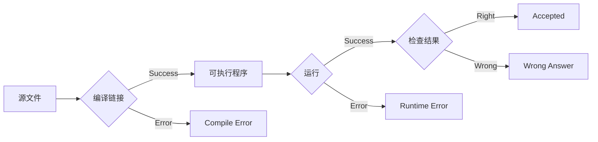

# 计算概论(C语言)习题课讲义01

## 内容提纲

1. 作业系统
2. 编程环境
3. 其他

------

### 作业系统：OpenJudge

- 网上注册

  [点击此处注册](http://openjudge.cn/register/)

- 加入小组

  注册完成后，在小组栏目中查找数院计概（C语言）

- 提交作业

  对源代码全选，复制和粘帖

##### 提交演示

两整数的加法

```c
#include <stdio.h>

int main(void)
{
    int a, b;
    scanf("%d%d", &a, &b);
    printf("%d", a + b);
    return 0;
}
```


#### 系统判定流程



还有一些其他错误，例如Time Limit Exceeded/Memory Limit Exceeded等。

###  编程建议

OpenJudge的帮助文档（http://openjudge.cn/help.html），给出了下述建议：

**Guideline 1 Do exactly what the problems demand.**

A mistake made by some newcomers is to print some friendly-looking prompt messages such as “Please input an integer” which the problems do not ask for. Another example of violating this guideline is to leave debug information in the output. Our judge system is automated. There is no human involvement in judging the solutions. Neither the administrators nor the developers will read any output by the solutions in normal circumstances. Hence, unrequested prompt messages are virtually useless. Worse still, undesired output may mess with the judging process, which in all probability will lead to rejection of the solution, even though it is logically correct.

**Guideline 2 Access only the standard input, the standard output and the memory.**

Your solution must always read the input data from the standard input and write the output data to the standard output. The only location that your solution can utilize for storage is the memory. Access to other resources such as disks and the file system is denied by the judge system. Any such attempt results in undefined behavior.

标准输入：一般代指屏幕；

标准输出：一般代指键盘；

**Guideline 3 Write standard-conforming code.** 

We promote the use of standard- conforming code. Certain compilers offer vendor-specific features beyond language standards. We have made efforts to disable these features to advocate standard-compliant programming practices. Solutions using these features are likely to fail compilation.

### 编程环境：CodeBlocks

#### 简介

**The open source, cross platform, free C, C++ and Fortran IDE.**

open source: 源代码公开

cross platform: Windows/Linux/Mac OS均可使用

IDE: 集成开发环境

#### 安装

Windows，[点击此处下载](http://sourceforge.net/projects/codeblocks/files/Binaries/17.12/Windows/codeblocks-17.12mingw-setup.exe)

#### 使用

1. 单个文件

   File->New->File...->C/C++ source->...

   优点：简单明了

   缺点：源文件、目标文件、可执行文件等缺乏组织结构，混乱；CodeBlocks中无法使用调试功能

2. 项目

   File->New->Project->Console application->C->...

   推荐该种方式

### 功能

语法高亮，自动缩进，语法提示等等

#### 对比：记事本写C语言

仍然以两整数的加法程序为例子。


