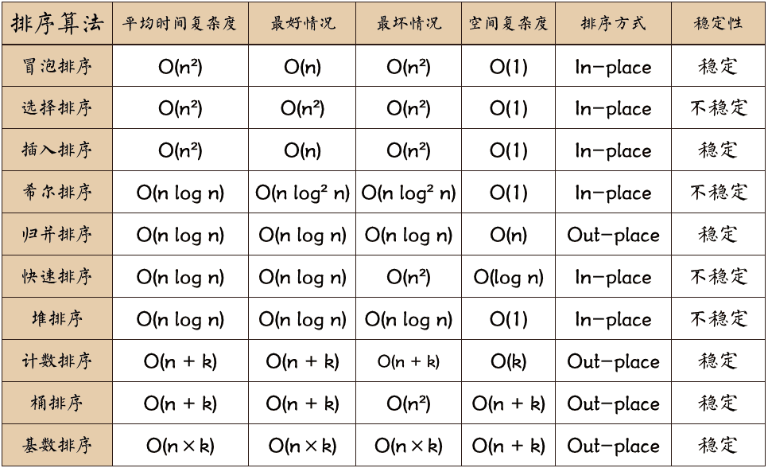
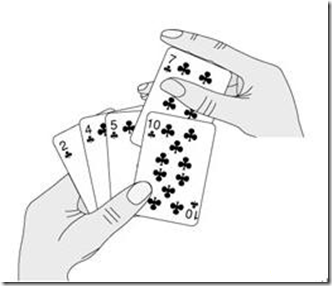
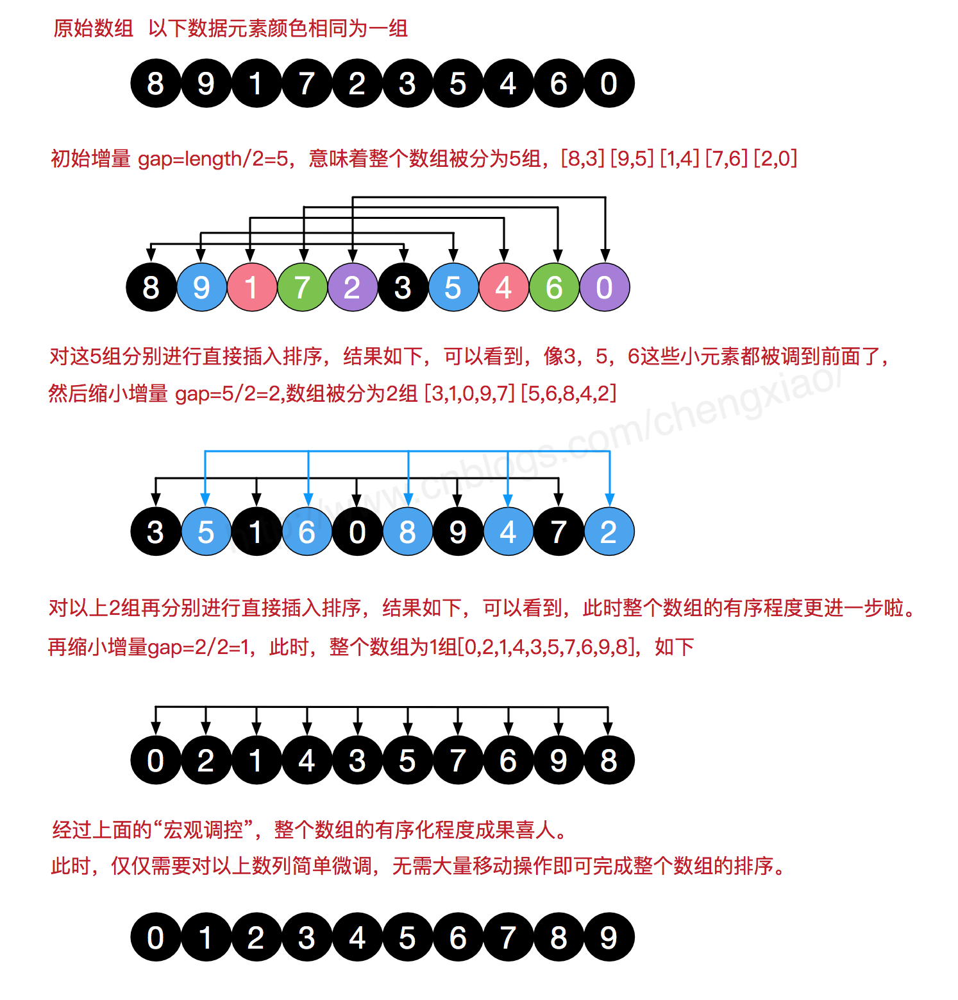

# 计算概论（C语言）习题课讲义08

## 内容概要

- 习题讲解

- 数组进阶

- 课堂练习

### 习题讲解

#### 输出所有字符数不超过10的行

代码点评一:

1. 读入一行 =>如何判断读入一行?

2. 进行判断

3. 少十输出 =>输出时, 结果如何存储?

4. 否则跳过

```c
#include <stdio.h>

int main()
{
    char Line[1000];
    char c;
    int count=0;

    while((c=getchar())!=EOF)
    {
        Line[count++]=c;
        if(c=='\n')  //读入一行
        {
            //进行判断
            if(count<=10) //输出
            {
                for(int i=0;i<count;i++)
                {
                    putchar(Line[i]);
                }
            }
            else //跳过
            {
            }
            count=0;
        }
    }
    return 0;
}
```

代码点评二:

```c
#include <stdio.h>
#include <string.h>                   // string.h?
int main(){
int i=0,c,k;
int line[10];
while((c=getchar())!=EOF)
{
    if(i==10)
    {
        i=0;
        while(getchar()!='\n') ;     // what for?
        continue;                    // continue?
    }
    else if(c=='\n')
    {
       for(k=0;k<i;++k)
       putchar(line[k]);
       printf("\n");
       i=0;
       continue;
    }
    else
        {
           line[i]=c;
           ++i;
        }
}
return 0;
}
```

#### 牛顿迭代及二分法

代码点评一:

```c
#include <stdio.h>
#include <math.h>
#define e0 1e-13
double f(double x);
double f_(double x); //f的导函数

void Newton(double x0){
    static int step=0;                 // static 的作用?
    if(fabs(x0*exp(x0)-1) < e0)
        printf("Newton method, root: %f ,iterations: %d\n",x0,step);
    else{
        x0=x0-f(x0)/f_(x0);
        step++;
        Newton(x0);
    }
}

void Bisec(double a,double b){
    static int step=0;
    double c;
    if(fabs(b*exp(b)-1) < e0)
        printf("Bisection method, root: %f ,iterations: %d",b,step);
    else {
        c=(a+b)*0.5;
        step++;
        if(f(c)*f(a)<0)
            Bisec(a,c);
        else
            Bisec(c,b);
    }
}

double f(double x0){
    return x0*exp(x0)-1;
}
double f_(double x){
    return (x+1.)*exp(x);
}
int main(){
    Newton(0.5);
    Bisec(0.5,0.6);
    return 0;
}
```

### 数组进阶

#### 多维数组

```c
// 二维数组定义
int a[3][4];

// 二维数组的初始化
int a[3][4] = {  
 {0, 1, 2, 3} ,   /*  初始化索引号为 0 的行 */
 {4, 5, 6, 7} ,   /*  初始化索引号为 1 的行 */
 {8, 9, 10, 11}   /*  初始化索引号为 2 的行 */
};

//内部嵌套的括号是可选的，下面的初始化与上面是等同的：
int a[3][4] = {0,1,2,3,4,5,6,7,8,9,10,11};
// 这实际上反映了二维数组,在内存上的线性结构.

// 二维数组变量的使用
int val = a[2][3];
```

##### 演示: 二维数组的线性结构

#### 数组做为函数参数

```c
//rev函数,将数组元素颠倒
void rev(int n, int a[])
{
    ...
}
```

注意,以数组为参数的函数可以改变实参数组的元素值(这本质上是一种地址传递).

而多维数组做为函数的参数时, 除了最左处的维度的长度,其他都需要给定(具体原因和多维数组的线性结构相关).

```c
double aaverage(int n, double a[][5])
{
    ...
}
```

#### 数组做为函数的返回值

C语言不允许返回一个完整的数组作为函数的返回值。
但是，可以通过数组名来返回一个指向数组的指针。

### 课堂练习



今天先介绍前四种.

#### 选择排序

主要想法: 选择适当的元素交换到适当位置.

过程演示:


#### 冒泡排序

主要想法: 让大的元素"冒"出来.

过程演示:


#### 插入排序

主要想法:



过程演示:


#### 希尔排序

主要想法: 对子列使用插入排序.

过程演示:



参考链接:

[1] https://www.toptal.com/developers/sorting-algorithms

[2] https://www.jianshu.com/p/a1e97094f61b